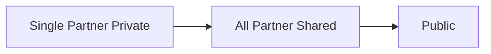
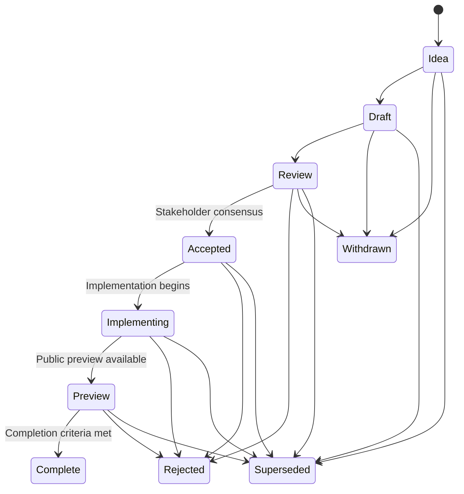

> These process documents are provided publicly for transparency, but many aspects of this process _are not_ public, and not all actively developed proposals may be public before reaching public preview.

## Terms and Definitions

**External Partner:** Any organization outside of Microsoft that participates in the development of proposals under this process.

**Hardware Vendor:** An external partner that provides hardware necessary for the implementation and testing of proposals.

**Microsoft Leadership:** Individuals within Microsoft who have decision-making authority over the staffing and implementation of proposals.

**Technical Leads:** Individuals within Microsoft who have technical authority and responsibility for the design and implementation of proposals.

## Definitions of Artifacts

Prior to this process teams have used formal and informal documents to capture ideas, proposals, and specifications for new features and changes. This section defines the key artifacts used in the current process, and aligns the terminology for consistency. Each artifact serves a distinct purpose and audience, ensuring clarity and effective communication throughout the development lifecycle.

| Term | Audience | Purpose | Location |
|------|----------|-------------|----------|
| Proposal | Implementers and stakeholders | Drives experimentation and development of a feature as an evolving and living document. Proivides visibility and alignment while enabling collaboration and feedback through the development cycle. | May live in the public or all partner shared proposal repositories. |
| Specification | Implementers and experienced users | Provides a detailed, finalized, authoritative reference for the behavior of a feature. | May be maintained in team-specific locations or the shared public repository. In-progress specifications may also be maintained in private repositories. |
| User Guide | End users | Explains how to use a feature or set of features. | May be maintained in team-specific locations; the default location is learn.microsoft.com. |
| Samples | End users | Code examples and sample projects that demonstrate how to use a feature or set of features. | May be maintained in team-specific locations; the default location is the DirectX-Samples repository. |

## Goals and Principles

This process adopts the high-level goals:

- Low barrier of entry for new ideas.
- Increase visibility into the state of each major development effort.
- Provide consistency with clearly defined criteria and expectations for all parties involved.
- Move as much information into the open as possible as early as possible.
- Adapt as necessary to maintain efficiency and quality.

The process is based on a set of foundational principles:

- **Iterative design:** Proposals should evolve as they move through the proposal process.
- **Progressive requirements:** Each stage in the proposal lifecycle introduces additional requirements that the proposal must satisfy to progress.
- **Visibility:** Proposals, their state, and decisions associated with them must be tracked and visible either in the document itself, or in associated metadata (git history, issues, meeting minutes, etc).
- **Consensus-based decision making:** Decisions should be made by consensus whenever possible. Microsoft Leadership should intervene when consensus cannot be reached.

## Scope

This process applies to proposals that may change Direct3D, DirectStorage, PIX, and other related technologies for Microsoft platforms and ecosystems. All substantive changes that have cross-functional impact across teams within Microsoft or external partners must use this process. Not all proposals must be public, but the process should bias towards public disclosure and development as early as possible.

## Mirrors and forks

This process is mirrored and forked in git repositories with different access permissions to facilitate different degrees of information sharing.

The diagram below shows the three layers of git repositories and the directional flow between them:

The _Single Partner Private_ repository is a git repository shared between a single external partner and Microsoft. It must only store **Idea** and **Draft** proposals which are not yet ready to be shared with wider audiences. Each partner must have their own repository, which Microsoft will create when a partner joins the project area.

The _All Partner Shared_ repository is a git repository shared between all external partners who have signed IP agreements with Microsoft to participate in a given project area.

The _Public_ repository is a git repository hosted publicly on GitHub.

## Macro proposal guidelines

* Do not manually include a changelog.
* Do not manually write a table of contents.
* Avoid unncessary duplication of content.
* Follow the guidance of the [technical-documentation skill](/.github/skills/technical-documentation/SKILL.md), and use it for review.

## Idea intake paths

All proposals are introduced in the **Idea** state regardless of how complete the proposal documentation is. An **Idea** may be contributed to any repository in the chain described in the [mirrors and forks](#mirrors-and-forks) section.

When a partner contributes an **Idea** to a single partner private repository the idea can only progress as far as the **Draft** state. When the authoring partner and Microsoft agree, a **Draft** proposal may be moved to either the all partner shared repository or the public repository for further development.

When a proposal moves from one repository to a more open repository, the source of truth for that proposal becomes the most open version of it, and development on the more private version ceases. Moving from a single partner private repository to the all partner shared repository may drop the proposal's history, but moving from the all partner shared repository to the public repository must retain all document history.

Proposals in **Idea** and **Draft** state live under the `proposals/ideas` subfolder of the repository, and proposals that reach a terminal state (**Complete**, **Withdrawn**, **Superseded**, or **Rejected**) are moved to the `proposals/archive` subfolder.

## Lifecycle overview

The normal path is **Idea**, **Draft**, **Review**, **Accepted**, **Implementing**, and **Complete**. **Withdrawn**, **Rejected**, and **Superseded** are terminal dispositions rather than steps on the normal path.

## Active states

### Idea

**Purpose:** Define a problem space or opportunity clearly enough to shape a discussion around possible directions.

**Requirements:**

- A concise problem statement.
- A clear motivation describing the use cases and benefits as appropriate.
- At least one author listed.
- Provisional listing of stakeholders.
- Listing of relevant prior work if any.

**Exit to Draft when:**

- The authors agree to develop the proposal.
- Microsoft agrees the proposal merits further investigation and assigns a sponsors.

### Draft

**Purpose:** Develop a proposal, evaluate alternatives, and produce a technical specification with sufficient detail to drive implementation.

**Requirements:**

- A proposed technical approach with sufficient detail to drive implementation, evaluate feasibility, and surface compatibility concerns.
- Expected impact across software components as applicable.
- Dependencies, risks, and unresolved questions.
- Proposed testing, tooling, and validation strategies.

**Exit to Review when:**

- The authors and sponsors agree that the proposal is ready for formal evaluation.
- Required reviewers and stakeholders are named.
- Known open questions are documented.
- A decision is made whether this proposal is to be developed privately or publicly.

### Review

**Purpose:** Facilitate formal review of the proposal and reach consensus among stakeholders.

**Requirements:**

- A stable revision of the proposal under review.
- A record of feedback and resolutions.
- An architectural review by technical leads with a documented decision recorded in the proposal.
- An agreed-upon response deadline for feedback.

**Exit to Accepted when:**

- The stakeholders reach consensus that the proposal is ready to advance.
- Microsoft leadership have agreed to staff implementation, and (if required) at least two hardware vendors have agreed to staff implementation.
### Accepted

**Purpose:** Record agreement on the technical direction enabling implementation planning.

**Requirements:**

- Implementation owners identified.
- Documented set of expected deliverables and approximate timelines.

**Exit to Implementing when:**

- Implementation is underway against the proposed plan.
- Work tracking metadata (issues, tasks, etc) has been created.
- Resources are assigned to work on deliverables.

### Implementing

**Purpose:** Deliver and validate the design.

**Requirements:**

- Up-to-date tracking of implementation work.
- Revisions to proposals as needed.
- Target release details, when known.

**Exit to Preview when:**

- Supported on at least two publicly available experimental vendor implementations.

### Preview

**Purpose:** To provide an experimental implementation to users for feedback.

**Requirements:**
- Finalized specification language published to authoritative locations.
- Conformance test suite is completely implemented.
- User documentation is published publicly.
- The proposal's authoritative location is the public repository.

**Exit to Complete when:**

- At least two retail vendor implementations are available for users.

### Complete

**Purpose:** To indicate that the proposal has met all release criteria and is fully implemented.

**Requirements:**
- All release criteria are met.
- Public retail software components are available for users and supported on hardware from at least two vendors.

## Other terminal states

**Withdrawn:** At any time before a proposal is **Accepted** a proposal's authors may withdraw the proposal. When a proposal is marked **Withdrawn**, a note must be added to the top of the proposal providing the date, reason, and any conditions that might justify reconsideration.

**Rejected:** At any time after a proposal enters the **Review** state it may be rejected. Rejection may either be the outcome of committee consensus or a Microsoft decision to withdraw support. When a proposal is marked **Rejected**, a note must be added to the top of the proposal providing the date, decision makers, and a detailed explanation of the reason for rejecting the proposal.

**Superseded:** At any time a proposal may be superseded by an alternative proposal. A proposal can be superseded because an alternative approach is selected, or because it is merged into another proposal. When a proposal is marked **Superseded** a note must be added to the top of the proposal providing the date, reason, and a link to the replacement.

## Transitions

**Idea to Draft:** The transition from **Idea** to **Draft** can be done at any time by agreement between the authors and sponsors.

**Draft to Review:** The transition from **Draft** to **Review** can be done at any time by agreement between the authors and sponsors. A pull request must be opened to put the proposal in the active proposals folder with the **Review** state on the appropriate repository.

**Review to Accepted:** The transition from **Review** to **Accepted** occurs when stakeholders reach consensus with no sustained objections, and Microsoft approves the transition.

**Accepted to Implementing:** The transition from **Accepted** to **Implementing** occurs when stakeholders agree on a rough plan for implementing the feature and at least two hardware vendors are staffing the implementation.

**Implementing to Preview:** The transition from **Implementing** to **Preview** occurs when public previews of software components are available for users supported on hardware from at least two vendors.

**Preview to Complete:** The transition from **Preview** to **Complete** occurs when all release criteria are met and public retail software components are available for users and supported on hardware from at least two vendors.

## Proposal triage

At least once a quarter Microsoft must perform a triage of all proposals in the public and shared private repositories to confirm ownership, activity and accuracy.
